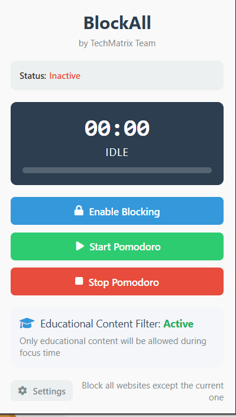

# BrahmaX_Global_Hackathon
This Project contains LMS Portal, Chrome Extension for Distraction Prevention BlockALL Embedded with AI, AI Assistant across Web and ChatBot


This repository consolidates multiple subprojects under the Adaptive Learning Master umbrella. Below you'll find documentation for each project along with placeholder images that represent each module.

## Table of Contents
- [BlockAll Chrome Extension](#blockall-chrome-extension)
- [Course Recommender](#course-recommender)
- [Web-scrapping Module](#web-scrapping-module)
- [Learning Legion Chrome Extension](#learning-legion-chrome-extension)

---

## BlockAll Chrome Extension



**BlockAll Chrome Extension** is a tool that helps you stay focused by blocking distracting websites and implements the Pomodoro technique. Built by the TechMatrix Team.

### Features
- **Website Blocking:** Blocks all websites except the one you're currently using and prevents opening new tabs with distracting content.
- **Pomodoro Technique:** Implements a customizable Pomodoro timer with set work and break durations.
- **Educational Content Filter:** Uses AI-powered analysis to allow educational content while blocking distractions.
- **Break Time Memes:** Displays funny memes during break periods to help relax.

### Installation
1. Download the repository as a ZIP file and extract it.
2. Open Chrome and navigate to `chrome://extensions/`.
3. Enable "Developer mode" using the toggle in the top-right corner.
4. Click "Load unpacked" and select the extracted folder.
5. The BlockAll extension icon will now appear in your Chrome toolbar.

### How to Use
- **Basic Blocking:** Click the extension icon and select "Enable Blocking" to block non-relevant websites.
- **Pomodoro Timer:** Start a work session via the popup interface; the extension will automatically cycle between work and break periods.
- **Educational Content Filter:** Open settings (gear icon) to provide your Groq API key and configure content filtering.
- **Customization:** Adjust work and break durations and filter settings in the settings panel.

### Requirements
- Chrome browser (version 88 or higher).
- Groq API key for educational content analysis (available at console.groq.com).

### Troubleshooting
- Refresh the page if the extension isn't working.
- Ensure a valid Groq API key is provided in settings.
- Verify an active internet connection.
- If issues persist, disable and re-enable the extension.

### License
MIT License (see LICENSE file for details).

**About TechMatrix Team:** BlockAll was created to help students and professionals maintain focus in a distracting digital environment.

---

## Course Recommender


The **Course Recommender** project analyzes the past learning experiences of students and suggests future courses.

### Overview
- Based on the Coursera reviews dataset available on [Kaggle](https://www.kaggle.com/septa97/100k-courseras-course-reviews-dataset).
- Implements two recommendation algorithms:
  1. Correlation Matrix-based Recommendation System.
  2. KNN Algorithm-based Recommendation System.

### Running the Project
1. Download the dataset.
2. Open `learning.ipynb` and run the cells.

---

## Web-scrapping Module


The **Web-scrapping Module** extracts information from the web using automated scripts.

### Getting Started
- Clone the repository and create a new virtual environment.
- Install dependencies using the `requirements.txt` file.

### Pre-Requisites
- Uses Chrome Driver for scraping. Download the latest version from the [official website](https://chromedriver.chromium.org/downloads).
- Set the path of the Chrome Driver in the respective script files (look for the line with `executable_path`).

### Running the Project
Run the following scripts separately:
- `Scripts/article.py` to extract articles (output in `Articles/articles.txt`).
- `Scripts/quora.py` to fetch answers (output in `Answers/answers.txt`).
- `Scripts/youtube.py` to get playlist links (output in `Videos/playlist.txt`).

Feel free to raise an issue if something goes wrong.

---

## Learning Legion Chrome Extension


**Learning Legion** is a Chrome extension that uses Generative AI to condense lengthy online articles into concise summaries.

### Team TechMatrix Solver
- **Mayank Bairagi** (3rd Year, Computer Science, Microsoft Learn Student Ambassador) - [LinkedIn](https://www.linkedin.com/in/mayank-das-bairagi-18639525a/) - Email: mayankbairagi03@gmail.com
- **Abhay Gupta** (3rd Year, Computer Science) - [LinkedIn](https://www.linkedin.com/in/abhay-gupta-197b17264/) - Email: contact2abhaygupta@gmail.com
- **Aditi Lakhera** (3rd Year, Computer Science) - [LinkedIn](https://www.linkedin.com/in/aditi-lakhera-b628802bb/) - Email: aditilakhera0@gmail.com
- **Aditya Vishwakarma** (3rd Year, Computer Science) - [LinkedIn](https://www.linkedin.com/in/aditya-vishwakarma-897380291/) - Email: Adityavishwakarmadd@gmail.com

### Installation
1. Download the extension folder.
2. Open a command prompt and navigate to the Learning Legion folder.
3. Install dependencies using:
   ```
   pip install -r requirements.txt
   ```
4. Follow [OpenAI Quickstart](https://platform.openai.com/docs/quickstart?context=python) to set up your API key.
5. Restart the command prompt if necessary and load the unpacked extension in Chrome (enable Developer Mode first).

### Usage
1. Open the command prompt and navigate to the Learning Legion folder.
2. Run the server with:
   ```
   python3 server.py
   ```
3. Open Chrome and click the Learning Legion icon to start summarizing articles.

---

## Additional Images

- 
- 
- 
- 
- 
- 

Thank you for exploring the Adaptive Learning Master Project. For more details, refer to the sections above. 
